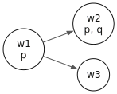
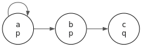

# Kripke Frames and Satisfaction

This chapter follows Chapter 1 of *Boxes and Diamonds*

using the `gamen-hs` library. We cover the language of basic modal
logic (Definition 1.1), formula construction (Definition 1.2),
relational models (Definition 1.6), the satisfaction relation
(Definition 1.7), truth in a model (Definition 1.9), and entailment
(Definition 1.23).

**Learning outcomes.** By the end of this chapter you will be able to:

1. Construct modal formulas using `Gamen.Formula`'s ADT (`Atom`,
   `Box`, `Diamond`, the propositional connectives).
2. Build a Kripke model — frame plus valuation — and evaluate any
   formula at a world using `satisfies`.
3. Explain the difference between $\square$ (true at *all*
   accessible worlds) and $\diamond$ (true at *some* accessible
   world), including why both are vacuously true at dead-end worlds.
4. Identify whether an English sentence requires modal or
   propositional logic, and translate it into a `Gamen.Formula`
   value.
5. Verify the duality $\square A \equiv \neg \diamond \neg A$
   computationally on a concrete model.

## Why Modal Logic?

> *"Can't an LLM just do all the reasoning for me?"*

Short answer: no. An LLM can generate plausible text *about*
reasoning, but it cannot guarantee that its conclusions follow from
its premises. It cannot prove that a set of rules is consistent. It
cannot tell you whether a guideline conflict is resolvable. It
hallucinates — confidently producing conclusions that are
grammatically correct and logically wrong.

Modal logic exists because ordinary propositional logic — "true or
false" — is not expressive enough for how we actually reason:

- **"It is raining"** is propositional. True or false.
- **"It might rain tomorrow"** is modal — about *possibility*
  across situations.
- **"You must file your taxes"** is modal — about *obligation*
  across acceptable outcomes.
- **"She knows the password"** is modal — about what's true *in
  every situation consistent with her information*.

These are not exotic philosophical puzzles. They are the structure
of everyday reasoning about rules, plans, knowledge, and time.
Modal logic gives us a precise language for it — and that precision
is what lets us *compute* with it.

### A Brief History

Modal logic began with C. I. Lewis in 1918, who was dissatisfied
with the paradoxes of material implication in classical logic
.
He introduced operators for *strict* implication — necessity and
possibility — to capture what we intuitively mean by "if…then."
Saul Kripke, as a teenager in the late 1950s, provided the
semantics that made modal logic rigorous: **possible worlds**
connected by an **accessibility relation**. This turned a
philosophical intuition into a mathematical framework — and opened
the door to computation.

Today, modal logic is the foundation of:

- **Software verification** — proving that programs satisfy safety
  and liveness properties (temporal logic).
- **AI and multi-agent systems** — reasoning about what agents
  know and believe (epistemic logic).
- **Legal and ethical reasoning** — formalising obligations,
  permissions, and prohibitions (deontic logic).
- **Clinical decision support** — ensuring guideline recommendations
  are consistent and computable.
- **Database theory** — query languages for graph-structured data.
- **Linguistics** — the semantics of "must," "might," "knows," and
  "will."

The LLM on your laptop uses none of this. It predicts the next
token. Modal logic *proves things*.

## Setup

Open GHCi against the project's library from the repository root:

```bash
cabal repl gamen
```

Modern GHCi accepts multi-line definitions when they're wrapped in
`:{ … :}` brackets. If you want to paste several lines without the
brackets every time, turn on multi-line mode:

```haskell
-- :ghci
:set +m
```

Now bring the relevant modules into scope:

```haskell
import Gamen.Formula
import Gamen.Kripke
import Gamen.Semantics
import Gamen.Visualize
import qualified Data.Set as Set
```



## The Language of Basic Modal Logic

The language of modal logic (Definition 1.1, B&D) starts with the
language of propositional logic (1–3 below) and extends it with two
new operators (4–5):

1. The propositional constant for falsity: $\bot$
2. Propositional variables: $p_0, p_1, p_2, \ldots$
3. Propositional connectives: $\neg, \land, \lor, \to$
4. The modal operator $\square$ ("box") — "necessarily" / "in all
   accessible situations"
5. The modal operator $\diamond$ ("diamond") — "possibly" / "in
   some accessible situation"

The key insight is that $\square$ and $\diamond$ are *quantifiers
over situations*, not truth values. To evaluate them we need a
structured space of situations — a Kripke model.

### Atomic Formulas

In `gamen-hs`, atomic propositions are values of type `Atom`,
exposed via the `Atom` pattern synonym so the literal syntax stays
familiar:

```haskell
p = Atom "p"
q = Atom "q"
r = Atom "r"
```



### Building Formulas (Definition 1.2)

Formulas are built inductively. Every atom is a formula, and if $A$
and $B$ are formulas, so are $\neg A$, $A \land B$, $A \lor B$,
$A \to B$, $A \leftrightarrow B$, $\square A$, and $\diamond A$.
The constant $\bot$ is also a formula; $\top$ abbreviates $\neg \bot$.

```haskell
falsum = Bot
verum  = top         -- top = Not Bot, exported from Gamen.Formula
```

```haskell
neg_p       = Not p
p_and_q     = And p q
p_or_q      = Or p q
p_implies_q = Implies p q
p_iff_q     = Iff p q
```

```haskell
box_p     = Box p
diamond_q = Diamond q
```

```haskell
-- Nested formulas
box_p_implies_p = Implies (Box p) p
k_schema        = Implies (Box (Implies p q))
                          (Implies (Box p) (Box q))
```



### Practice: Translate English to Formulas

Try writing each one as a `Formula`, then expand the hint to check
your answer. Let `p = Atom "p"` mean *"it is raining"* and
`q = Atom "q"` mean *"I have an umbrella."*

**1.** "It is not raining."

<details><summary>Reveal answer</summary>
<code>Not p</code> — simply $\neg p$.
</details>

**2.** "If it is raining, then I have an umbrella."

<details><summary>Reveal answer</summary>
<code>Implies p q</code> — $p \to q$.
</details>

**3.** "It is necessarily raining." (In all accessible situations,
it is raining.)

<details><summary>Reveal answer</summary>
<code>Box p</code> — $\square p$.
</details>

**4.** "It is possible that I have an umbrella."

<details><summary>Reveal answer</summary>
<code>Diamond q</code> — $\diamond q$.
</details>

**5.** "If it is necessarily raining, then it is raining." (The T
axiom — is this always true?)

<details><summary>Reveal answer</summary>
<code>Implies (Box p) p</code> — $\square p \to p$. This is valid
on reflexive frames; we'll see why in Chapter 2.
</details>

**6.** "It is possible that it is raining and I don't have an
umbrella."

<details><summary>Reveal answer</summary>
<code>Diamond (And p (Not q))</code> — $\diamond (p \land \neg q)$.
</details>

**7.** "If it is necessarily the case that rain implies umbrellas,
then if it necessarily rains, I necessarily have an umbrella."
(Schema K)

<details><summary>Reveal answer</summary>
<code>Implies (Box (Implies p q)) (Implies (Box p) (Box q))</code>
— $\square(p \to q) \to (\square p \to \square q)$. This is valid
on *every* frame; it is the defining axiom of the weakest normal
modal logic, K.
</details>

### Modal-Free Formulas

A formula is *modal-free* if it contains no $\square$ or $\diamond$:

```haskell
-- :eval
isModalFree (And p (Not q))
```

```output
True
```
```haskell
-- :eval
isModalFree (Implies p (Box q))
```

```output
False
```
{% include sidenote.html id="kr-lens-syntax" content="<strong>KR Lens — Formal Syntax as a Medium for Human Expression.</strong> Davis, Shrobe & Szolovits (1993) describe one role of a knowledge representation as a <em>medium for expressing human knowledge</em>. The translation exercises above make that role concrete: every time you write <code>Box (Implies p q)</code> for 'if it necessarily rains then I have an umbrella,' you are encoding a piece of natural-language reasoning into a form gamen-hs can compute with. Natural language is ambiguous — 'must' can be deontic or epistemic; 'if' can be material or counterfactual — and choosing $\\square$ vs $\\diamond$ forces you to be precise. That precision is what makes automated consistency checking possible, and what makes LLMs (which operate on natural language) unsuitable substitutes for formal reasoning." %}

### Practice: Modal or Not?

For each English sentence, decide whether it requires modal logic
or can be expressed in propositional logic alone.

**1.** "The patient has a fever and a cough."

<details><summary>Reveal answer</summary>
<strong>Propositional.</strong> A simple conjunction:
<em>fever</em> ∧ <em>cough</em>. No modality needed.
</details>

**2.** "The bridge might collapse under heavy load."

<details><summary>Reveal answer</summary>
<strong>Modal.</strong> "Might" expresses <em>possibility</em> —
there exists a situation where the bridge collapses. Requires
$\diamond$.
</details>

**3.** "If the test is positive, the patient is infected."

<details><summary>Reveal answer</summary>
<strong>Propositional.</strong> A material implication:
<em>positive</em> → <em>infected</em>. No modality.
</details>

**4.** "Every employee must complete safety training."

<details><summary>Reveal answer</summary>
<strong>Modal.</strong> "Must" expresses <em>obligation</em> — in
all acceptable scenarios, the employee completes training.
Requires $\square$ (deontic interpretation).
</details>

**5.** "Alice knows that the server is down."

<details><summary>Reveal answer</summary>
<strong>Modal.</strong> "Knows" means the server is down in
<em>every situation consistent with Alice's information</em>. This
is epistemic $\square$.
</details>

**6.** "It is raining or it is not raining."

<details><summary>Reveal answer</summary>
<strong>Propositional.</strong> The law of excluded middle:
$p \lor \neg p$. A tautology.
</details>

## Relational Models

A *model* $M = \langle W, R, V \rangle$ consists of three components
(Definition 1.6):

1. A non-empty set of **worlds** $W$.
2. A binary **accessibility relation** $R \subseteq W \times W$.
3. A **valuation** $V$ assigning to each propositional variable $p$
   the set $V(p) \subseteq W$ of worlds where $p$ is true.

### What are "worlds"?

The word "worlds" sounds metaphysical, but think of them concretely
as **situations** or **states**:

- **Software verification** — states of a running program.
- **Game theory** — positions in a game (board configurations in
  chess).
- **Clinical reasoning** — possible patient scenarios under
  different treatment choices.
- **Epistemic logic** — situations consistent with what an agent
  knows.
- **Deontic logic** — outcomes that comply with the rules.

The accessibility relation says which situations are reachable or
relevant from which. When we write $wRw'$ we mean: from the
perspective of situation $w$, situation $w'$ is an accessible
alternative.





### Figure 1.1 from B&D

The book's first example model has three worlds with a small
accessibility relation:

- $W = \{w_1, w_2, w_3\}$
- $R = \{(w_1, w_2), (w_1, w_3)\}$ — $w_1$ accesses both $w_2$ and
  $w_3$; $w_2$ and $w_3$ are dead-ends.
- $V(p) = \{w_1, w_2\}$, $V(q) = \{w_2\}$.

```haskell
frame11 = mkFrame ["w1", "w2", "w3"]
                  [("w1", "w2"), ("w1", "w3")]
model11 = mkModel frame11
                  [("p", ["w1", "w2"]), ("q", ["w2"])]
```

```haskell
-- :viz
toGraphvizModel model11
```

<figure class="kripke"></figure>
{% include sidenote.html id="kr-lens-surrogate" content="<strong>KR Lens — Kripke Models as Surrogates.</strong> Davis et al. describe a representation as a <em>surrogate</em> — a substitute for the real thing that lets us reason without direct interaction. <code>model11</code> is exactly this: a mathematical surrogate for some real domain of situations. The accessibility relation encodes which transitions are possible. Davis et al. warn that 'perfect fidelity is impossible': we have chosen to model only two atomic propositions and ignore everything else. That choice — what to represent and what to omit — is the central act of knowledge representation." %}

## Truth at a World

We use the **satisfaction relation** $\Vdash$ to express that a
formula is true at a particular world in a model (Definition 1.7,
B&D). We write $M, w \Vdash A$ to mean *"formula $A$ is true at
world $w$ in model $M$."* In `gamen-hs` this is the function
`satisfies :: Model -> World -> Formula -> Bool`.

The satisfaction relation is defined inductively — propositional
cases first, then the modal cases that give $\square$ and
$\diamond$ their meaning:

| Clause | Rule |
|---|---|
| 1 | $M, w \not\Vdash \bot$ (never) |
| 2 | $M, w \Vdash p$ iff $w \in V(p)$ |
| 3 | $M, w \Vdash \neg B$ iff $M, w \not\Vdash B$ |
| 4 | $M, w \Vdash B \land C$ iff $M, w \Vdash B$ and $M, w \Vdash C$ |
| 5 | $M, w \Vdash B \lor C$ iff $M, w \Vdash B$ or $M, w \Vdash C$ |
| 6 | $M, w \Vdash B \to C$ iff $M, w \not\Vdash B$ or $M, w \Vdash C$ |
| 7 | $M, w \Vdash \square B$ iff $M, w' \Vdash B$ for *all* $w'$ with $wRw'$ |
| 8 | $M, w \Vdash \diamond B$ iff $M, w' \Vdash B$ for *some* $w'$ with $wRw'$ |

Clauses 1–6 are standard propositional logic. Clauses 7–8 are the
modal heart:

- $\square B$ is true at $w$ if $B$ holds in *every* world
  accessible from $w$.
- $\diamond B$ is true at $w$ if $B$ holds in *some* world
  accessible from $w$.

### Problem 1.1 — All Nine Items

B&D's first exercise asks which of the following hold on the
Figure 1.1 model. Working through them with `satisfies`:

```haskell
-- :eval
satisfies model11 "w1" q
```

```output
False
```
```haskell
-- :eval
satisfies model11 "w3" (Not q)
```

```output
True
```
```haskell
-- :eval
satisfies model11 "w1" (Or p q)
```

```output
True
```
```haskell
-- :eval
satisfies model11 "w1" (Box (Or p q))
```

```output
False
```
```haskell
-- :eval
satisfies model11 "w3" (Box q)
```

```output
True
```
```haskell
-- :eval
satisfies model11 "w3" (Box Bot)
```

```output
True
```
```haskell
-- :eval
satisfies model11 "w1" (Diamond q)
```

```output
True
```
```haskell
-- :eval
satisfies model11 "w1" (Box q)
```

```output
False
```
```haskell
-- :eval
satisfies model11 "w1" (Not (Box (Box (Not q))))
```

```output
False
```
Reading the results:

- **Item 1 → False.** $V(q) = \{w_2\}$, so $q$ is false at $w_1$.
- **Item 2 → True.** $q$ is false at $w_3$, so $\neg q$ is true.
- **Item 3 → True.** $p$ is true at $w_1$, so $p \lor q$ holds —
  only one disjunct needed.
- **Item 4 → False.** $\square (p \lor q)$ at $w_1$ requires
  $p \lor q$ at both $w_2$ and $w_3$. $w_3$ has neither, so it
  fails.
- **Item 5 → True (vacuously).** $w_3$ has no accessible worlds.
  $\square q$ requires $q$ at *all* successors — when there are
  none, the universal is vacuously satisfied.
- **Item 6 → True (vacuously).** Same reasoning: $\square \bot$ at
  a dead-end is vacuously true, because there are no successors to
  check.
- **Item 7 → True.** $\diamond q$ at $w_1$ requires $q$ at *some*
  successor; $w_2$ is accessible and $q$ holds there.
- **Item 8 → False.** $\square q$ at $w_1$ requires $q$ at *all*
  successors; $w_3$ is accessible and $q$ fails there.
- **Item 9 → False.** $\square \square \neg q$ is true at $w_1$:
  both $w_2$ and $w_3$ have no successors, so $\square \neg q$ is
  vacuously true at both. Hence $\neg \square \square \neg q$ is
  false.

### Practice: Evaluate Formulas on Figure 1.1

Try to work each out by hand from the figure above before checking.

**1.** Does $M, w_2 \Vdash \square p$ hold?

<details><summary>Reveal answer</summary>
<strong>Yes (vacuously).</strong> $w_2$ has no accessible worlds,
so $\square p$ is true at $w_2$ for any formula.
<code>satisfies model11 "w2" (Box p)</code> returns <code>True</code>.
</details>

**2.** Does $M, w_1 \Vdash \diamond (p \land q)$ hold?

<details><summary>Reveal answer</summary>
<strong>Yes.</strong> $w_2$ is accessible from $w_1$, and both $p$
and $q$ are true at $w_2$.
<code>satisfies model11 "w1" (Diamond (And p q))</code> returns
<code>True</code>.
</details>

**3.** Does $M, w_1 \Vdash \square p$ hold?

<details><summary>Reveal answer</summary>
<strong>No.</strong> $w_3$ is accessible from $w_1$, but
$V(p) = \{w_1, w_2\}$, so $p$ is false at $w_3$. Therefore
$\square p$ fails.
<code>satisfies model11 "w1" (Box p)</code> returns
<code>False</code>.
</details>

**4.** Does $M, w_1 \Vdash \diamond q \land \diamond \neg q$ hold?

<details><summary>Reveal answer</summary>
<strong>Yes.</strong> $\diamond q$ — $w_2$ is accessible, $q$
holds. $\diamond \neg q$ — $w_3$ is accessible, $q$ fails. Both
diamonds are satisfied, so the conjunction holds.
<code>satisfies model11 "w1" (And (Diamond q) (Diamond (Not q)))</code>
returns <code>True</code>. From $w_1$'s perspective, $q$ is
<em>contingent</em> — both possible and possibly false.
</details>

**5. Challenge.** Construct a formula that is true at $w_3$ but
false at both $w_1$ and $w_2$.

<details><summary>Reveal answer</summary>
Several work. <code>And (Not p) (Not q)</code> — neither $p$ nor
$q$ holds at $w_3$, but at least one holds at the other worlds.
Or <code>Box Bot</code> — vacuously true at $w_3$ (no successors),
false at $w_1$ (which has successors).
</details>

## Duality of $\square$ and $\diamond$

$\square$ and $\diamond$ are *duals* — each is definable in terms
of the other (Proposition 1.8, B&D):

- $\square A$ is equivalent to $\neg \diamond \neg A$
  ("necessarily $A$" means "it is not possible that not-$A$").
- $\diamond A$ is equivalent to $\neg \square \neg A$
  ("possibly $A$" means "it is not necessary that not-$A$").

If you have encountered first-order logic, this is analogous to
how $\forall$ and $\exists$ are duals
.

We can verify the duality at every world of `model11`:

```haskell
-- :eval
[ ( w
  , satisfies model11 w (Box p)     == satisfies model11 w (Not (Diamond (Not p)))
  , satisfies model11 w (Diamond p) == satisfies model11 w (Not (Box (Not p)))
  )
| w <- ["w1", "w2", "w3"]
]
```

```output
[("w1",True,True),("w2",True,True),("w3",True,True)]
```
Each tuple is `(world, box-duality, diamond-duality)`. All
`True`s confirm the duality holds at every world.

## Truth in a Model

A formula $A$ is *true in a model* $M$ (written $M \Vdash A$) if it
is true at every world in $M$ (Definition 1.9). The library
exposes this as `isTrueIn`:

```haskell
-- :eval
isTrueIn model11 p
```

```output
False
```
```haskell
-- :eval
isTrueIn model11 top
```

```output
True
```
```haskell
-- :eval
isTrueIn model11 (Box Bot)
```

```output
False
```
The first is `False` because $p$ fails at $w_3$. The second is
trivially `True` — $\top$ holds everywhere by Definition 1.3. The
third is `False` because $\square \bot$ fails at $w_1$, which has
successors.

## Entailment

A set of formulas $\Gamma$ *entails* $A$ in a model $M$ if,
whenever every formula in $\Gamma$ is true at a world $w$, $A$ is
also true at $w$ (Definition 1.23). The function `entails` takes a
list of premises plus a conclusion:

```haskell
frame2 = mkFrame ["w1", "w2"] [("w1", "w2")]
model2 = mkModel frame2 [("p", ["w1", "w2"]), ("q", ["w1", "w2"])]
```

```haskell
-- :eval
entails model2 [p] (Or p q)
```

```output
True
```
```haskell
-- :eval
entails model2 [p, q] (And p q)
```

```output
True
```
The first checks $p \models p \lor q$; the second checks
$\{p, q\} \models p \land q$. Both succeed in this model where $p$
and $q$ hold at every world.

### Practice: Translate and Check

Translate each English sentence into a `Formula`, then check it on
`model11`. Use $p =$ "it is sunny" and $q =$ "there is traffic."

**1.** "In every accessible situation, it is sunny or there is
traffic."

<details><summary>Reveal answer</summary>
<code>Box (Or p q)</code>. At $w_1$:
<code>satisfies model11 "w1" (Box (Or p q))</code> returns
<code>False</code>, because $w_3$ has neither.
</details>

**2.** "There is some accessible situation where it is sunny but
there is no traffic."

<details><summary>Reveal answer</summary>
<code>Diamond (And p (Not q))</code>. Try it:
<code>satisfies model11 "w1" (Diamond (And p (Not q)))</code>
returns <code>False</code>! At $w_2$, $p$ holds but $q$ also
holds, so $p \land \neg q$ fails. At $w_3$, neither $p$ nor $q$
holds, so $p \land \neg q$ also fails. Careful model checking
catches an intuitive mistake.
</details>

**3.** "If it is necessarily sunny, then it is sunny."

<details><summary>Reveal answer</summary>
<code>Implies (Box p) p</code> — Schema T, valid on
<em>reflexive</em> frames. <code>frame11</code> is not reflexive
(no world accesses itself), so the schema can fail. At $w_3$,
$\square p$ is vacuously true (no successors) but $p$ is false. So
<code>isTrueIn model11 (Implies (Box p) p)</code> returns
<code>False</code>.
</details>

## Exploring on Your Own

Some directions from B&D worth trying:

- Verify Proposition 1.19 — Schema K,
  $\square (A \to B) \to (\square A \to \square B)$, is valid on
  *every* frame. Test it on `model11` and on a few other models.
- Pick an invalid schema such as $A \to \square A$ and find a
  world that falsifies it.
- Build a *reflexive* frame (every world accesses itself) and
  verify that Schema T, $\square A \to A$, holds at every world.
- Build the counterexample model from Figure 1.2 of B&D.

Template for your own model:

```haskell
myFrame = mkFrame
  ["a", "b", "c"]
  [("a", "b"), ("b", "c"), ("a", "a")]

myModel = mkModel myFrame
  [ ("p", ["a", "b"])
  , ("q", ["c"])
  ]
```

```haskell
-- :eval
satisfies myModel "a" (Diamond q)
```

```output
False
```
```haskell
-- :eval
satisfies myModel "a" (Box p)
```

```output
True
```
```haskell
-- :viz
toGraphvizModel myModel
```

<figure class="kripke"></figure>
---

*Next chapter: prefixed tableau and the closure rule.*
