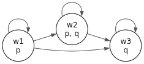
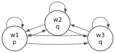

# Frame Definability

This chapter follows Chapter 2 of *Boxes and Diamonds*. It covers
validity on a frame (Definition 2.1), the five standard frame
properties (Definition 2.3), and the **correspondence** between
modal schemas and those properties — the bridge between syntax
and semantics that lets us name the modal logics K, T, KD, K4, S4,
and S5.

## Setup

```bash
cabal repl gamen
```

```haskell
-- :ghci
:set +m
```

```haskell
import Gamen.Formula
import Gamen.Kripke
import Gamen.Semantics
import Gamen.FrameProperties
import Gamen.Visualize

p = Atom "p"
q = Atom "q"
```

## Why Frame Properties Matter

Two clinical scenarios illustrate why this chapter matters:

**Doctor's orders.** A physician writes "the patient *must* take
this medication." Does that mean the patient *is* taking it? No —
obligation and actuality are different. The world where the
obligation holds need not be the world where it is satisfied.

**Reliable knowledge.** A radiologist reads an X-ray and says "I
*know* there is a fracture." Does that mean a fracture exists?
Yes — knowledge is *factive*. You cannot know something false.

These two scenarios have different *logical structures* — and
those structures show up in the *shape of the accessibility
relation*. In Chapter 1 we treated each model individually.
Chapter 2 asks the deeper question:

> What does the *shape* of the accessibility relation force to be
> true?

This turns out to be one of the most powerful ideas in modal
logic. Different shapes correspond to different *logics* — and
those logics map onto real reasoning domains:

| Frame property | Logic | Domain interpretation |
|---|---|---|
| Reflexive | T | "If $p$ is necessary, then $p$ is true" — knowledge (you know only truths) |
| Serial | KD | "If $p$ is obligatory, then $p$ is permitted" — deontic reasoning |
| Transitive | K4 | "If $p$ is necessary, it's necessarily necessary" — introspection |
| Equivalence relation | S5 | Within each class, worlds agree on what's possible — epistemic logic |

The correspondence isn't a coincidence — Sahlqvist (1975) proved
it for a wide class of axioms. This chapter explores the specific
correspondences that matter most.

{% include sidenote.html id="kr-lens-commitment" content="<strong>KR Lens — Ontological Commitment.</strong> Davis et al. argue that a knowledge representation embodies an <em>ontological commitment</em> — a decision about 'in what terms should I think about the world?' Choosing a frame property is exactly such a commitment. When you require seriality you commit to a world where dead ends don't exist. When you require reflexivity you commit to a world where the actual situation is always among the accessible alternatives. These aren't implementation details — they're domain assumptions that determine what your system can and cannot represent." %}

## Validity on a Frame

A formula is *valid on a frame* $F = \langle W, R \rangle$ if it
is true in **every** model based on $F$ — for every possible
valuation $V$ (Definition 2.1). This tells us what the frame's
*structure* forces to be true, independent of which propositions
hold where.

`gamen-hs` exposes this as `isValidOnFrame :: Frame -> Formula
-> Bool`.

```haskell
frame_simple = mkFrame ["w1", "w2"] [("w1", "w2")]
```

Two formulas, two verdicts:

```haskell
-- :eval
( isValidOnFrame frame_simple (Box top)            -- valid on every frame
, isValidOnFrame frame_simple (Implies (Box p) p)  -- Schema T — fails here
)
```

```output
(True,False)
```
The first is `True`: $\square \top$ is valid on every frame
because $\top$ is true everywhere. The second is `False`: at
$w_2$ (which has no successors), $\square p$ is vacuously true
but $p$ can be false, so the implication fails.



## The Five Frame Properties

Five properties of the accessibility relation drive the
correspondence theorems (Definition 2.3):

| Property | Condition | Intuition |
|---|---|---|
| Reflexive | every world accesses itself | "you can always stay where you are" |
| Symmetric | $wRw' \Rightarrow w'Rw$ | "access goes both ways" |
| Transitive | $wRw' \land w'Rw'' \Rightarrow wRw''$ | "access chains compose" |
| Serial | every world has at least one successor | "there's always somewhere to go" |
| Euclidean | $wRw' \land wRw'' \Rightarrow w'Rw''$ | "successors see each other" |

A preorder (S4 frame) is reflexive + transitive:

```haskell
preorder = mkFrame ["w1", "w2", "w3"]
  [ ("w1", "w1"), ("w2", "w2"), ("w3", "w3")
  , ("w1", "w2"), ("w2", "w3"), ("w1", "w3")
  ]
```

```haskell
-- :viz
toGraphvizModel (mkModel preorder [("p", ["w1", "w2"]), ("q", ["w2", "w3"])])
```

<figure class="kripke"></figure>
```haskell
-- :eval
( isReflexive preorder
, isSymmetric preorder
, isTransitive preorder
, isSerial    preorder
, isEuclidean preorder
)
```

```output
(True,False,True,True,False)
```
A preorder is reflexive + transitive (and reflexive implies
serial), but not necessarily symmetric or euclidean.

An equivalence relation (S5 frame) adds symmetry:

```haskell
equiv = mkFrame ["w1", "w2", "w3"]
  [ ("w1", "w1"), ("w2", "w2"), ("w3", "w3")
  , ("w1", "w2"), ("w2", "w1")
  , ("w2", "w3"), ("w3", "w2")
  , ("w1", "w3"), ("w3", "w1")
  ]
```

```haskell
-- :viz
toGraphvizModel (mkModel equiv [("p", ["w1"]), ("q", ["w2", "w3"])])
```

<figure class="kripke"></figure>
```haskell
-- :eval
( isReflexive equiv
, isSymmetric equiv
, isTransitive equiv
, isSerial    equiv
, isEuclidean equiv
)
```

```output
(True,True,True,True,True)
```
All five properties hold — equivalence relations are the most
constrained frame class in this chapter.

### Practice: Identify Frame Properties

**1.** A frame with $\{a, b\}$ and $\{a \to b, b \to a\}$.

<details><summary>Reveal answer</summary>
<strong>Symmetric</strong> (yes), <strong>Serial</strong> (yes —
each world has a successor), <strong>Reflexive</strong> (no —
neither accesses itself), <strong>Transitive</strong> (no —
$a \to b \to a$ but $a \not\to a$), <strong>Euclidean</strong> (no
— $aRb$ and $aRb$ would require $bRb$, but $b$ only accesses $a$).
</details>

**2.** A frame with $\{a, b, c\}$ and $\{a \to a, a \to b, a \to
c\}$.

<details><summary>Reveal answer</summary>
<strong>Reflexive</strong> (no — only $a$ accesses itself),
<strong>Serial</strong> (no — $b$ and $c$ have no successors),
<strong>Symmetric</strong> (no — $a \to b$ but $b \not\to a$),
<strong>Transitive</strong> (yes — vacuously, since $b$ and $c$
have no further successors), <strong>Euclidean</strong> (no —
$a \to b$ and $a \to c$ but $b \not\to c$).
</details>

**3.** A single world $\{w\}$ with $\{w \to w\}$.

<details><summary>Reveal answer</summary>
<strong>All five properties hold!</strong> Reflexive, symmetric,
transitive, serial, euclidean — all trivially. The simplest S5
frame.
</details>

## The Correspondence Results

Each frame property corresponds to a modal schema being valid on
the frame. This is the **frame correspondence theorem**:

| Schema | Name | Formula | Frame property |
|---|---|---|---|
| **K** | Distribution | $\square(p \to q) \to (\square p \to \square q)$ | *all frames* |
| **T** | Reflexivity | $\square p \to p$ | reflexive |
| **D** | Seriality | $\square p \to \diamond p$ | serial |
| **B** | Symmetry | $p \to \square \diamond p$ | symmetric |
| **4** | Transitivity | $\square p \to \square \square p$ | transitive |
| **5** | Euclideanness | $\diamond p \to \square \diamond p$ | euclidean |

Let's verify each one — and see what fails when the property is
absent.

### Schema T: $\square p \to p$ corresponds to reflexivity

If every world can see itself, then whatever is necessary is
actual. Conversely, if $\square p \to p$ is valid, the frame must
be reflexive.

```haskell
schema_t = Implies (Box p) p

reflexive_frame     = mkFrame ["w1", "w2"]
                              [("w1", "w1"), ("w1", "w2"), ("w2", "w2")]
non_reflexive_frame = mkFrame ["w1", "w2"] [("w1", "w2")]
```

```haskell
-- :eval
( ( isReflexive reflexive_frame
  , isValidOnFrame reflexive_frame     schema_t)
, ( isReflexive non_reflexive_frame
  , isValidOnFrame non_reflexive_frame schema_t)
)
```

```output
((True,True),(False,False))
```
Schema T fails on the second frame because at $w_2$ (no
successors) $\square p$ is vacuously true but $p$ can be false.

### Schema D: $\square p \to \diamond p$ corresponds to seriality

Every world has at least one successor. If $\square p$ holds, then
some accessible world has $p$ — so $\diamond p$ also holds. A
world with no successors makes $\square p$ vacuously true while
$\diamond p$ is false.



```haskell
schema_d = Implies (Box p) (Diamond p)

serial_frame     = mkFrame ["w1", "w2"] [("w1", "w2"), ("w2", "w1")]
non_serial_frame = mkFrame ["w1", "w2"] [("w1", "w2")]
```

```haskell
-- :eval
( ( isSerial serial_frame
  , isValidOnFrame serial_frame     schema_d)
, ( isSerial non_serial_frame
  , isValidOnFrame non_serial_frame schema_d)
)
```

```output
((True,True),(False,False))
```
### Schema B: $p \to \square \diamond p$ corresponds to symmetry

If you can return wherever you came from, then if $p$ is true
here, every accessible world can see back to where $p$ holds.

```haskell
schema_b = Implies p (Box (Diamond p))

symmetric_frame     = mkFrame ["w1", "w2"]
                              [ ("w1", "w2"), ("w2", "w1")
                              , ("w1", "w1"), ("w2", "w2")
                              ]
non_symmetric_frame = mkFrame ["w1", "w2"] [("w1", "w2"), ("w2", "w2")]
```

```haskell
-- :eval
( isValidOnFrame symmetric_frame     schema_b
, isValidOnFrame non_symmetric_frame schema_b
)
```

```output
(True,False)
```
### Schema 4: $\square p \to \square \square p$ corresponds to transitivity

If accessibility chains compose, knowing $\square p$ means knowing
it's *necessarily* necessary — you can't escape necessity by going
further along the chain.

```haskell
schema_4 = Implies (Box p) (Box (Box p))

transitive_frame     = mkFrame ["w1", "w2", "w3"]
                                [("w1", "w2"), ("w2", "w3"), ("w1", "w3")]
non_transitive_frame = mkFrame ["w1", "w2", "w3"]
                                [("w1", "w2"), ("w2", "w3")]
```

```haskell
-- :eval
( isValidOnFrame transitive_frame     schema_4
, isValidOnFrame non_transitive_frame schema_4
)
```

```output
(True,False)
```
### Schema 5: $\diamond p \to \square \diamond p$ corresponds to euclideanness

If all successors of a world can see each other, then if something
is possible, every accessible world agrees that it's possible.

```haskell
schema_5 = Implies (Diamond p) (Box (Diamond p))

euclidean_frame     = mkFrame ["w1", "w2", "w3"]
                              [ ("w1", "w2"), ("w1", "w3")
                              , ("w2", "w2"), ("w2", "w3")
                              , ("w3", "w2"), ("w3", "w3")
                              ]
non_euclidean_frame = mkFrame ["w1", "w2", "w3"]
                              [("w1", "w2"), ("w1", "w3")]
```

```haskell
-- :eval
( isValidOnFrame euclidean_frame     schema_5
, isValidOnFrame non_euclidean_frame schema_5
)
```

```output
(True,False)
```
### Practice: Match the Schema

**1.** A frame where every world has a successor, but no world
accesses itself. Which schema is guaranteed valid?

<details><summary>Reveal answer</summary>
<strong>Schema D</strong> ($\square p \to \diamond p$). The frame
is serial but not reflexive. Schema T is NOT guaranteed —
seriality is weaker than reflexivity.
</details>

**2.** Frame with $w_1 \to w_2$ and $w_2 \to w_3$ but $w_1 \not\to
w_3$. Does Schema 4 ($\square p \to \square \square p$) hold?

<details><summary>Reveal answer</summary>
<strong>No.</strong> The frame isn't transitive. At $w_1$,
$\square p$ requires $p$ at $w_2$. But $\square \square p$
requires $\square p$ at $w_2$, which needs $p$ at $w_3$. Since
$w_1$ doesn't directly see $w_3$, there's a gap.
</details>

**3.** An equivalence relation (reflexive + symmetric +
transitive). Which schemas are valid?

<details><summary>Reveal answer</summary>
<strong>All five</strong>: T (reflexive), B (symmetric), 4
(transitive), 5 (equivalence implies euclidean), D (reflexive
implies serial). This is why S5 is such a strong logic.
</details>

## Normal Modal Logics

Combining schemas gives named systems:

| System | Axioms | Frame class | Application |
|---|---|---|---|
| **K** | K | all frames | minimal modal logic |
| **KD** | K + D | serial frames | deontic logic (obligations) |
| **T** = KT | K + T | reflexive frames | knowledge (factive) |
| **K4** | K + 4 | transitive frames | base for provability logic |
| **S4** | K + T + 4 | preorders | Gödel translation of intuitionistic logic |
| **S5** | K + T + 5 | equivalence relations | epistemic logic |

Verifying which schemas hold on the S4 (preorder) and S5
(equivalence) frames we built earlier:

```haskell
schema_k = Implies (Box (Implies p q)) (Implies (Box p) (Box q))
```

```haskell
-- :eval
( isValidOnFrame preorder schema_k
, isValidOnFrame preorder schema_t
, isValidOnFrame preorder schema_d
, isValidOnFrame preorder schema_b
, isValidOnFrame preorder schema_4
, isValidOnFrame preorder schema_5
)
```

```output
(True,True,True,False,True,False)
```
The preorder validates K, T, D, 4 but fails B and 5 — consistent
with S4 not being S5.

```haskell
-- :eval
( isValidOnFrame equiv schema_k
, isValidOnFrame equiv schema_t
, isValidOnFrame equiv schema_d
, isValidOnFrame equiv schema_b
, isValidOnFrame equiv schema_4
, isValidOnFrame equiv schema_5
)
```

```output
(True,True,True,True,True,True)
```
S5 validates all six — equivalence relations satisfy every
standard property.

### Practice: Choose the Right Logic

**1.** Modelling clinical guideline obligations — a guideline
that obliges something impossible is incoherent. What's the
weakest logic that prevents this?

<details><summary>Reveal answer</summary>
<strong>KD.</strong> Seriality (Schema D) ensures obligations are
at least permitted. You don't need reflexivity (T) — obligations
don't need to be <em>actual</em>, just <em>achievable</em>.
</details>

**2.** Modelling an agent's knowledge — knowledge entails truth,
no false knowledge. Weakest logic?

<details><summary>Reveal answer</summary>
<strong>T (= KT)</strong> at minimum. Schema T captures the
<em>factivity</em> of knowledge. Most epistemic logics use S4 or
S5, which add introspection.
</details>

**3.** A logic where, within each equivalence class, possibility
and necessity are uniform. Which?

<details><summary>Reveal answer</summary>
<strong>S5.</strong> Schema 5 ($\diamond p \to \square \diamond
p$) guarantees uniformity within each equivalence class.
</details>

{% include sidenote.html id="kr-lens-sanctioned" content="<strong>KR Lens — Sanctioned Inferences.</strong> Davis et al. describe a representation's third role as a <em>fragmentary theory of intelligent reasoning</em> — it determines which inferences are <em>sanctioned</em>. The frame correspondence theorem makes this concrete: choosing reflexivity sanctions $\\square p \\to p$; choosing seriality sanctions $\\square p \\to \\diamond p$. More sanctioned inferences mean more computation — S5 validates more schemas than K, but checking validity on equivalence relations isn't cheaper than on arbitrary frames. The expressiveness/tractability tension recurs in Chapter 5 (filtrations) and Chapter 6 (tableaux)." %}

## Exercises

**1.** Build a frame that is transitive but not reflexive (K4 but
not S4) and verify Schema 4 is valid but T is not.

<details><summary>Reveal answer</summary>
<code>mkFrame ["w1","w2","w3"] [("w1","w2"),("w2","w3"),("w1","w3")]</code>.
Transitive ($w_1 \to w_2 \to w_3$ and $w_1 \to w_3$) but not
reflexive. <code>isValidOnFrame f schema_4</code> returns
<code>True</code>; <code>isValidOnFrame f schema_t</code> returns
<code>False</code>.
</details>

**2.** Does reflexivity imply seriality? Check whether D is valid
on every reflexive frame.

<details><summary>Reveal answer</summary>
Yes. If $w \to w$ then $w$ has a successor (itself), so seriality
holds. Every reflexive frame is serial.
</details>

**3.** Construct a frame that is serial but not reflexive. Verify
D holds but T doesn't.

<details><summary>Reveal answer</summary>
<code>mkFrame ["w1","w2"] [("w1","w2"),("w2","w1")]</code>. Each
world has a successor, neither accesses itself. The standard KD
shape.
</details>

**4. Challenge.** Can a frame be euclidean without being
transitive? Build one.

<details><summary>Reveal answer</summary>
Yes. <code>mkFrame ["w1","w2","w3"] [("w1","w2"),("w2","w2"),("w2","w3"),("w3","w3"),("w3","w2")]</code>.
At $w_1$ the only successor is $w_2$ — euclidean is vacuously
satisfied. At $w_2$ both $w_2$ and $w_3$ are successors and they
mutually access each other. But $w_1 \to w_2 \to w_3$ while
$w_1 \not\to w_3$ — not transitive.
</details>

---

*Next chapter: axiomatic derivations — the syntactic counterpart
to frame validity.*
