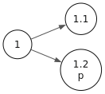

# Modal Tableaux

This chapter follows Chapter 6 of *Boxes and Diamonds*. It covers
**prefixed signed tableaux** — the proof procedure that
`gamen-hs` actually runs when you call `tableauProves` or
`tableauConsistent`. Chapters 1–5 told us *what* modal logic is;
this chapter tells us *how to compute with it*.

## Setup

```bash
cabal repl gamen
```

```haskell
-- :ghci
:set +m
```

```haskell
import Gamen.Formula
import Gamen.Kripke
import Gamen.Semantics
import Gamen.Tableau
import Gamen.Visualize

p = Atom "p"
q = Atom "q"
r = Atom "r"
```

## Why Tableaux Matter

Chapters 1–5 developed modal logic as a *mathematical theory* —
formulas, Kripke models, frame properties, derivability. None of
that tells you how to actually *decide* whether a given formula
is valid. If someone hands you a formula and asks "is this a
theorem of S4?", what do you do?

Tableaux answer that with a **mechanical procedure**:

1. Assume the formula is false at some world.
2. Apply decomposition rules — deterministically, no creativity
   required.
3. Either every branch closes (the formula is valid) or an open
   branch survives (the formula is not valid, and the branch *is*
   the countermodel).

This is where modal logic becomes a **practical tool** rather
than a mathematical theory. Tableau provers power automated
guideline-conflict detection: given two clinical guidelines, can
they both be satisfied? A tableau either proves consistency or
produces a concrete scenario where they clash.

{% include sidenote.html id="explainable" content="<strong>Explainability for free.</strong> MYCIN (1976) had a WHY command that traced the rule chain that led to a conclusion. A tableau does this <em>by construction</em> — the entire proof tree is the explanation. There is no black box, no hidden state. Every step is visible and checkable. <code>buildTableau</code> returns the full <code>Tableau</code> structure, which is just a list of <code>Branch</code> values, each a list of <code>PrefixedFormula</code> — eminently inspectable." %}

## Prefixed Signed Formulas

Tableaux for modal logic decorate each formula with two pieces of
metadata:

- A **sign** — either `T` (true) or `F` (false).
- A **prefix** — a sequence of positive integers naming a world
  in the prefix tree (`1`, `1.1`, `1.2`, `1.2.3`, …).

The prefix `σ.n` names a world *accessible* from `σ`. The prefix
`1` names the root world where we make our initial assumption.

```haskell
σ   = mkPrefix [1]      -- root
σ1  = mkPrefix [1, 1]   -- a child of σ
σ12 = mkPrefix [1, 2]   -- another child of σ
```

```haskell
-- :eval
( show σ
, show σ1
, show (extendPrefix σ 3)
, show (parentPrefix σ1)
)
```

```output
("1","1.1","1.3","1")
```
A **prefixed signed formula** is a triple of (prefix, sign,
formula). `pfTrue σ A` means "$A$ is true at world $σ$";
`pfFalse σ A` means "$A$ is false at world $σ$":

```haskell
-- :eval
( show (pfTrue  σ (Box (Implies p q)))
, show (pfFalse σ (Implies (Box p) (Box q)))
)
```

```output
("1 T \9633(p \8594 q)","1 F (\9633p \8594 \9633q)")
```
A **branch** is *closed* when it contains both `σ T A` and
`σ F A` for some prefix and formula — a direct contradiction. A
**tableau** is closed when *every* branch is closed; otherwise
some branch survives and produces a counter-model.

### Practice: prefixes and signs

**1.** Which prefix represents a world accessible from $1.2$?

<details><summary>Reveal answer</summary>
Any prefix of the form $1.2.n$ — e.g. <code>mkPrefix [1, 2, 1]</code>.
The child extends the parent prefix by one more positive integer.
</details>

**2.** If a branch contains $1.1\ T\ p$ and $1.1\ F\ p$, is it
open or closed?

<details><summary>Reveal answer</summary>
<strong>Closed.</strong> Both signs at the same prefix and formula
contradict.
</details>

**3.** Can a branch contain $1\ T\ p$ and $1.1\ F\ p$ and remain
open?

<details><summary>Reveal answer</summary>
<strong>Yes.</strong> Different prefixes name different worlds.
$p$ can be true at one world and false at another — that's the
whole point of Kripke semantics.
</details>

## The K Rules

Two families of rules, one for the propositional connectives and
one for the modal operators (Tables 6.1 and 6.2 of B&D).

**Propositional rules** at prefix $σ$:

| Rule | From | Add |
|---|---|---|
| ¬T | $σ\ T\ \neg A$ | $σ\ F\ A$ |
| ¬F | $σ\ F\ \neg A$ | $σ\ T\ A$ |
| ∧T | $σ\ T\ A \land B$ | $σ\ T\ A$, $σ\ T\ B$ |
| ∧F | $σ\ F\ A \land B$ | split: $σ\ F\ A$ \| $σ\ F\ B$ |
| ∨T | $σ\ T\ A \lor B$ | split: $σ\ T\ A$ \| $σ\ T\ B$ |
| ∨F | $σ\ F\ A \lor B$ | $σ\ F\ A$, $σ\ F\ B$ |
| →T | $σ\ T\ A \to B$ | split: $σ\ F\ A$ \| $σ\ T\ B$ |
| →F | $σ\ F\ A \to B$ | $σ\ T\ A$, $σ\ F\ B$ |

**Modal rules for K** distinguish "used" and "new" prefixes:

| Rule | From | Add |
|---|---|---|
| □T | $σ\ T\ \square A$ | $σ.n\ T\ A$ for each *used* child prefix |
| □F | $σ\ F\ \square A$ | $σ.n\ F\ A$ for a *new* prefix |
| ◇T | $σ\ T\ \diamond A$ | $σ.n\ T\ A$ for a *new* prefix |
| ◇F | $σ\ F\ \diamond A$ | $σ.n\ F\ A$ for each *used* child prefix |

The "used vs. new" distinction is essential for soundness: ◇T
introduces a witness world (existential), □T checks every world
already in scope (universal).

## Worked Example: $(\square p \land \square q) \to \square (p \land q)$

A K-theorem. Let's trace it by hand, then verify with the prover.

**Initial assumption:** $1\ F\ ((\square p \land \square q) \to
\square (p \land q))$

1. **→F** on the implication: add $1\ T\ (\square p \land \square
   q)$ and $1\ F\ \square (p \land q)$.
2. **∧T** on the conjunction: add $1\ T\ \square p$ and $1\ T\
   \square q$.
3. **□F** on $1\ F\ \square (p \land q)$: introduce a fresh
   prefix $1.1$ and add $1.1\ F\ (p \land q)$.
4. **□T** on $1\ T\ \square p$ at the now-used prefix $1.1$: add
   $1.1\ T\ p$.
5. **□T** on $1\ T\ \square q$ at $1.1$: add $1.1\ T\ q$.
6. **∧F** on $1.1\ F\ (p \land q)$: split into two branches.
   - Left branch: $1.1\ F\ p$ — but $1.1\ T\ p$ is already there,
     so this branch *closes*.
   - Right branch: $1.1\ F\ q$ — but $1.1\ T\ q$ is already there,
     so this branch *closes*.

Both branches close, so the tableau is closed and $(\square p
\land \square q) \to \square (p \land q)$ is K-provable.
Verification:

```haskell
-- :eval
tableauProves systemK [] (Implies (And (Box p) (Box q)) (Box (And p q)))
```

```output
True
```
## Worked Example: $\diamond (p \lor q) \to (\diamond p \lor
\diamond q)$

Another K-theorem. Trace:

**Initial:** $1\ F\ \diamond (p \lor q) \to (\diamond p \lor
\diamond q)$

1. **→F**: $1\ T\ \diamond (p \lor q)$, $1\ F\ (\diamond p \lor
   \diamond q)$.
2. **∨F** on the disjunction: $1\ F\ \diamond p$, $1\ F\ \diamond
   q$.
3. **◇T** on $1\ T\ \diamond (p \lor q)$: introduce fresh $1.1$
   with $1.1\ T\ (p \lor q)$.
4. **◇F** on $1\ F\ \diamond p$ at $1.1$: add $1.1\ F\ p$.
5. **◇F** on $1\ F\ \diamond q$ at $1.1$: add $1.1\ F\ q$.
6. **∨T** on $1.1\ T\ (p \lor q)$: split.
   - Left: $1.1\ T\ p$ + $1.1\ F\ p$ — closed.
   - Right: $1.1\ T\ q$ + $1.1\ F\ q$ — closed.

```haskell
-- :eval
tableauProves systemK [] (Implies (Diamond (Or p q)) (Or (Diamond p) (Diamond q)))
```

```output
True
```
### Practice: predict the verdict

For each formula, predict whether the K-tableau closes, then
check.

**1.** $\square (p \land q) \to \square p$

<details><summary>Reveal answer</summary>
<strong>Valid.</strong> If $p \land q$ holds at all accessible
worlds, certainly $p$ does. The tableau closes.
</details>

**2.** $\square p \to \square (p \lor q)$

<details><summary>Reveal answer</summary>
<strong>Valid.</strong> If $p$ holds at all accessible worlds,
then $p \lor q$ does. The tableau closes.
</details>

**3.** $\diamond p \to \square p$

<details><summary>Reveal answer</summary>
<strong>Not valid.</strong> "Some successor has $p$" doesn't
imply "every successor has $p$." The tableau stays open and
produces a countermodel.
</details>

```haskell
-- :eval
( tableauProves systemK [] (Implies (Box (And p q)) (Box p))
, tableauProves systemK [] (Implies (Box p) (Box (Or p q)))
, tableauProves systemK [] (Implies (Diamond p) (Box p))
)
```

```output
(True,True,False)
```
## Counter-Model Extraction

When the tableau stays open, the surviving branch *is* the
counter-model. The function `extractCountermodel` builds a
`Model` from an open branch (Theorem 6.19 of B&D). Worlds are
the prefixes; the accessibility relation is the prefix-tree
parent-child relation; the valuation is read off from the
$T$-signed atoms on the branch.

A simple non-theorem to extract from:

```haskell
nonTheorem = Implies (Diamond p) (Box p)
tab = buildTableau systemK [pfFalse (mkPrefix [1]) nonTheorem] 1000
```

```haskell
-- :eval
( length (tableauBranches tab)
, all isClosed (tableauBranches tab)
)
```

```output
(1,False)
```
One branch, not closed (the K rules for $\diamond p$ and
$\square p$ don't introduce splitting in this combination — they
just spawn two fresh prefixes). The open branch yields a
countermodel:

```haskell
openBranches = [b | b <- tableauBranches tab, not (isClosed b)]
counterModel = extractCountermodel (head openBranches)
```

```haskell
-- :viz
toGraphvizModel counterModel
```

<figure class="kripke"></figure>
The figure shows: a root world $1$ with two successors. At one
successor $p$ holds (witnessing $\diamond p$); at the other $p$
fails (refuting $\square p$). The implication $\diamond p \to
\square p$ fails at the root.

## System-Specific Rules

For each frame property we get an additional rule (Table 6.4 of
B&D). gamen-hs ships them as `System` records: `systemK`,
`systemKT`, `systemKD`, `systemKB`, `systemK4`, `systemS4`,
`systemS5`. The rule sets and witnessRules differ — but the
caller-facing API is the same.

The T schema $\square p \to p$ provides a clean comparison:

```haskell
-- :eval
( tableauProves systemK  [] (Implies (Box p) p)
, tableauProves systemKT [] (Implies (Box p) p)
, tableauProves systemS4 [] (Implies (Box p) p)
, tableauProves systemS5 [] (Implies (Box p) p)
)
```

```output
(False,True,True,True)
```
K can't prove it (no reflexivity); KT, S4, S5 all can. Same
formula, different verdicts — that's the point of having
multiple systems.

The D schema $\square p \to \diamond p$:

```haskell
-- :eval
( tableauProves systemK  [] (Implies (Box p) (Diamond p))
, tableauProves systemKD [] (Implies (Box p) (Diamond p))
, tableauProves systemKT [] (Implies (Box p) (Diamond p))
)
```

```output
(False,True,True)
```
K rejects (dead-end frames possible); KD and KT prove it.

The 5 schema $\diamond p \to \square \diamond p$ — only S5
proves:

```haskell
-- :eval
( tableauProves systemK  [] (Implies (Diamond p) (Box (Diamond p)))
, tableauProves systemS4 [] (Implies (Diamond p) (Box (Diamond p)))
, tableauProves systemS5 [] (Implies (Diamond p) (Box (Diamond p)))
)
```

```output
(False,False,True)
```
## Consistency Checking

The dual question — *is this set of formulas jointly
satisfiable?* — uses `tableauConsistent`:

```haskell
-- :eval
( tableauConsistent systemK [Box p, Diamond (Not p)]
, tableauConsistent systemK [Box p, Box (Not p)]
, tableauConsistent systemKD [Box p, Box (Not p)]
)
```

```output
(False,True,False)
```
Reading the three:

- $\{\square p, \diamond \neg p\}$ in K — **inconsistent**. The
  set forces a successor satisfying both $p$ (by $\square p$) and
  $\neg p$ (witness of $\diamond \neg p$). Contradiction. Output:
  `False`.
- $\{\square p, \square \neg p\}$ in K — **consistent**. A
  dead-end world makes both vacuously true. Output: `True`.
- Same set in KD — **inconsistent**. Seriality forces a
  successor, which must satisfy both $p$ and $\neg p$ — same
  clash as the first case. Output: `False`.

## Why the Tableau is the Right Tool

Three properties make tableaux the workhorse of automated modal
reasoning:

1. **Decidability.** The blocking mechanism (Chapter 5) bounds
   tableau depth, so every search terminates.
2. **Counter-model extraction.** A failed proof isn't a void
   answer — the open branch *is* a witness. Reviewers and
   end-users can inspect why a guideline pair clashes.
3. **Configurability.** Adding a frame property means adding a
   rule. gamen-hs's `System` record carries `usedPrefixRules` and
   `witnessRules` lists; building a custom system is a few lines.

For health informatics: a tableau-based consistency check on
guideline formulas gives you not just a verdict but a *witness*.
When the prover says "consistent," you can extract a model where
all guidelines are jointly satisfied. When it says "inconsistent,"
the closed tableau pinpoints which formulas clash. That kind of
explainability is hard to get from black-box reasoners.

### Exercise

**1.** Take any formula that fails in K but holds in S5. Use
`buildTableau` to inspect both tableaux side-by-side and explain
the difference.

<details><summary>Reveal answer</summary>
The 5 schema $\diamond p \to \square \diamond p$ is a clean
example. <code>buildTableau systemK [pfFalse (mkPrefix [1]) phi]
1000</code> stays open — the surviving branch witnesses a frame
where $\diamond p$ holds at one world but not at another
accessible one. <code>buildTableau systemS5</code> closes
because the euclidean rule (Table 6.3 of B&D) forces every
accessible world to share the same set of $\diamond$-formulas.
</details>

**2.** Construct a satisfiable formula whose witness model has at
least three distinct worlds.

<details><summary>Reveal answer</summary>
$\diamond p \land \diamond q \land \diamond \neg p$, with $p$ and
$q$ different atoms. <code>tableauConsistent systemK [Diamond p,
Diamond q, Diamond (Not p)]</code> returns <code>True</code>.
The countermodel extracted from the open tableau has a root with
three successors: one for the $p$-witness, one for the
$q$-witness, one for the $\neg p$-witness.
</details>

**3.** Why does the K-tableau for $\square \diamond p \to
\diamond \square p$ stay open, even though both sides "feel"
similar?

<details><summary>Reveal answer</summary>
Different quantifier orderings. $\square \diamond p$ means "every
accessible world has some accessible $p$-world" — a $\forall
\exists$ pattern. $\diamond \square p$ means "some accessible
world has every accessible world satisfy $p$" — a $\exists
\forall$ pattern. The implication $\forall \exists \to \exists
\forall$ doesn't hold in classical first-order logic and doesn't
hold in K either. The countermodel extracted from the open
tableau has a root with two successors $w_1, w_2$, each with its
own $p$-witness $w_{1.1}, w_{2.1}$ — but no single successor
where every onward step has $p$.
</details>

---

*Next chapter: temporal logic — adding G/F/H/P operators that
quantify over time rather than possibility.*
