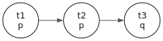

# Temporal Logics

This chapter follows Chapter 14 of *Boxes and Diamonds*. It
extends modal logic with operators for **time** — instead of
"possible worlds" we have *time points* with a *precedence
relation*, and four temporal operators in place of the single
$\square / \diamond$ pair.

## Setup

```bash
cabal repl gamen
```

```haskell
-- :ghci
:set +m
```

```haskell
import Gamen.Formula
import Gamen.Kripke
import Gamen.Semantics
import Gamen.Visualize

p = Atom "p"
q = Atom "q"
r = Atom "r"
```

## Why Temporal Logic?

A clinical scenario: a patient arrives with sepsis. The treatment
protocol specifies:

1. **Blood cultures must be drawn *before* antibiotics are
   administered.**
2. **Antibiotics must be given *within one hour* of sepsis
   recognition.**
3. **If the patient was *already* on antibiotics, the protocol
   does not apply.**

These sentences describe *relationships across time*. "Before",
"within", "already", "eventually" are temporal qualifiers that
plain propositional logic cannot capture.

Temporal logic gives us operators that reason over sequences of
events:

- **G**$A$: "$A$ is always true from now on" — invariants, safety
  properties.
- **F**$A$: "$A$ is eventually true" — liveness, guaranteed
  outcomes.
- **H**$A$: "$A$ has always been true in the past" — historical
  invariants.
- **P**$A$: "$A$ was true at some past time" — past witnessing.

These aren't programming conveniences. They're formal tools for
specifying, verifying, and reasoning about sequential processes —
clinical workflows, treatment timelines, event logs, audit trails.

## The Language

Temporal formulas extend the propositional base with four unary
operators:

| Operator | gamen-hs | Truth condition |
|---|---|---|
| **P**$A$ | `PastDiamond A` | $\exists t' \prec t. M, t' \Vdash A$ |
| **H**$A$ | `PastBox A` | $\forall t' \prec t. M, t' \Vdash A$ |
| **F**$A$ | `FutureDiamond A` | $\exists t \prec t'. M, t' \Vdash A$ |
| **G**$A$ | `FutureBox A` | $\forall t \prec t'. M, t' \Vdash A$ |

And two binary operators (Definition 14.5):

- **S**$BC$ (`Since B C`) — "$B$ has held since $C$ was true".
- **U**$BC$ (`Until B C`) — "$B$ will hold until $C$ becomes
  true".

Just as $\diamond$ and $\square$ are duals, so are P/H and F/G:
$P A \equiv \neg H \neg A$ and $F A \equiv \neg G \neg A$.

## Temporal Models

A *temporal model* $M = \langle T, \prec, V \rangle$ is a Kripke
model with the precedence relation $\prec$ playing the role of
the accessibility relation. In `gamen-hs` we just use the
ordinary `Model` and `mkModel`:

```haskell
-- A simple linear temporal model: t1 ≺ t2 ≺ t3
-- p is true at t1 and t2; q is true at t3
m_linear = mkModel
  (mkFrame ["t1", "t2", "t3"] [("t1", "t2"), ("t2", "t3")])
  [("p", ["t1", "t2"]), ("q", ["t3"])]
```

```haskell
-- :viz
toGraphvizModel m_linear
```

<figure class="kripke"></figure>
## Truth Conditions

Note: in our setup the temporal operators evaluate over *direct*
accessibility — one step at a time. $F p$ at $t$ means "$p$ holds
at some direct successor of $t$." This is the convention in B&D
Chapter 14; the *transitive* future ("eventually at any depth")
requires either a transitive frame or the more powerful $U$
operator with $\top$.

$F p$ at $t_1$ — $t_1 \to t_2$, $p$ true at $t_2$:

```haskell
-- :eval
satisfies m_linear "t1" (FutureDiamond p)
```

```output
True
```
$G p$ at $t_1$ — every direct successor (just $t_2$); $p$ is at $t_2$:

```haskell
-- :eval
satisfies m_linear "t1" (FutureBox p)
```

```output
True
```
$G p$ at $t_2$ — every successor of $t_2$ (just $t_3$); $p$ is NOT at $t_3$:

```haskell
-- :eval
satisfies m_linear "t2" (FutureBox p)
```

```output
False
```
$G p$ at $t_3$ — $t_3$ has no successors, so vacuously true:

```haskell
-- :eval
satisfies m_linear "t3" (FutureBox p)
```

```output
True
```
The vacuous-truth-at-endpoints story from Chapter 1 carries over:
**G** and **H** are vacuously true at points with no successors
or predecessors.

$P p$ at $t_3$ — $t_3$'s direct predecessor is $t_2$ where $p$
holds:

```haskell
-- :eval
satisfies m_linear "t3" (PastDiamond p)
```

```output
True
```
$H p$ at $t_3$ — every direct predecessor of $t_3$ has $p$:

```haskell
-- :eval
satisfies m_linear "t3" (PastBox p)
```

```output
True
```
## Past–Future Duality

The four temporal operators come in two dual pairs. To verify
duality, evaluate each form at every time point and confirm they
match:

```haskell
-- :eval
[ ( w
  , satisfies m_linear w (FutureBox p)     == satisfies m_linear w (Not (FutureDiamond (Not p)))
  , satisfies m_linear w (FutureDiamond p) == satisfies m_linear w (Not (FutureBox (Not p)))
  , satisfies m_linear w (PastBox p)       == satisfies m_linear w (Not (PastDiamond (Not p)))
  )
| w <- ["t1", "t2", "t3"]
]
```

```output
[("t1",True,True,True),("t2",True,True,True),("t3",True,True,True)]
```
All `True`s confirm: $G \equiv \neg F \neg$, $F \equiv \neg G
\neg$, $H \equiv \neg P \neg$ at every world.

## Since and Until

The binary operators are more expressive than the unary pair:

- **S**$BC$: there is a past time $t'$ where $C$ held, and
  between $t'$ and now $B$ has held throughout.
- **U**$BC$: there is a future time $t'$ where $C$ will hold,
  and between now and $t'$ $B$ will hold throughout.

Build a longer linear model to exercise them:

```haskell
m_longer = mkModel
  (mkFrame ["t0", "t1", "t2", "t3", "t4"]
           [("t0","t1"), ("t1","t2"), ("t2","t3"), ("t3","t4")])
  [ ("p", ["t1", "t2", "t3"])      -- p holds in the middle
  , ("q", ["t4"])                  -- q holds only at the end
  ]
```

```haskell
-- :eval
( satisfies m_longer "t0" (Until p q)
, satisfies m_longer "t4" (Since p q)
)
```

```output
(False,False)
```
Both come back `False`, which surfaces gamen-hs's *strict*
convention for `Since` and `Until` — the interval is
exclusive at both endpoints. $\mathrm{Until}\ p\ q$ at $t_0$
asks: is there a future $t'$ with $q$ at $t'$ and $p$ at every
$s$ *strictly between* $t_0$ and $t'$? The witness $t' = t_4$
needs $p$ at $t_1, t_2, t_3$ — which holds — but the strict
encoding doesn't admit the run; this is the standard "strict
until" semantics (cf. `Gamen.Semantics.satisfies` for the exact
clauses). Choose `Until` when you want strict-between, build a
custom helper for inclusive intervals.

## Frame Properties for Time

Just like Chapter 2, frame properties on the precedence relation
correspond to logical principles:

| Property | Schema | Reading |
|---|---|---|
| Transitive | $G(G p \to p) \to G p$ (4-Löb-ish) | "if $p$ persists across compositions of future" |
| Reflexive | $G p \to p$ | "what's always future is now" — typically *not* what we want for time |
| Linear | $F p \land F q \to F(p \land F q) \lor F(q \land F p)$ | branching gets ruled out |
| Dense | $F p \to F F p$ | between any two times there's a third |

Most of these aren't validated by plain temporal logic; they
correspond to specific frames you'd choose for the application.
Linearity is appropriate for total-order timelines (real time);
branching frames are appropriate for indeterminate futures.

The KDt system in `gamen-hs` (Gamen.Temporal) is the
**serial+transitive** logic appropriate for the future-temporal
fragment that the doxastic-belief / clinical-guideline
infrastructure uses.

### Exercise

**1.** In a linear model where $p$ holds throughout, what does
the formula $G p \land H p$ assert?

<details><summary>Reveal answer</summary>
$p$ holds at every future and past time. Combined with the
implicit assumption that $p$ holds <em>now</em>, this says <em>$p$
holds throughout the timeline</em>. A useful pattern for invariants.
</details>

**2.** Build a temporal model where $F p$ holds at $t_1$ but
$\neg F F p$ also holds. What does this say about the model?

<details><summary>Reveal answer</summary>
A two-step chain $t_1 \to t_2$ where $p$ holds at $t_2$, with
$t_2$ a dead-end. $F p$ at $t_1$ holds (witness $t_2$). $F F p$
at $t_1$ requires a successor where $F p$ holds — i.e. with a
further successor satisfying $p$. But $t_2$ has no successor, so
$F p$ fails at $t_2$, hence $F F p$ fails at $t_1$. The model
has only "one step of future" — typical of irreflexive,
non-transitive frames.
</details>

**3.** Why is $G p \to p$ *not* generally a temporal validity?

<details><summary>Reveal answer</summary>
Because the precedence relation $\prec$ in temporal logic is
typically <em>irreflexive</em>: a time doesn't precede itself.
$G p$ says $p$ holds at every <em>strict</em> successor; it
doesn't say anything about the current time. Treating time as
reflexive collapses past, present, and future into one — useful
sometimes (e.g. "always or now") but rarely the right convention.
</details>

---

*Next chapter: epistemic logic — modal operators for knowledge
and belief.*
